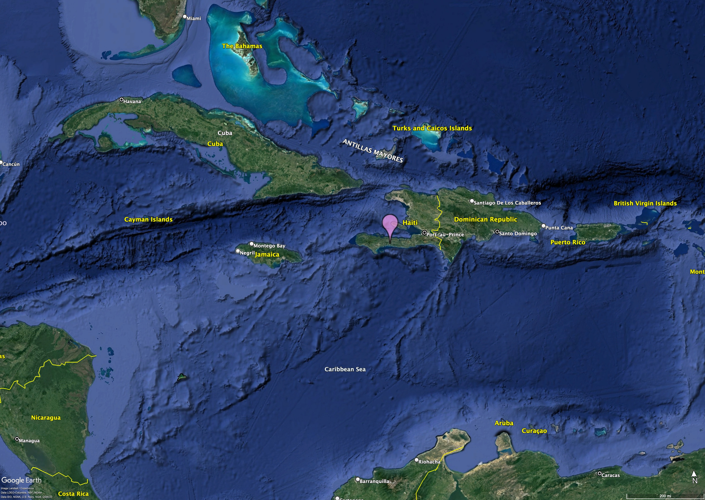

## Description

## Habitat & Distribution
A. crassispatha is endemic to Haiti where only a few dozen individuals are thought to survive in the wild on the southern peninsula. 

<iframe src="https://www.google.com/maps/embed?pb=!1m14!1m12!1m3!1d10215377.464808691!2d-72.99127786111146!3d19.314451742833583!2m3!1f0!2f0!3f0!3m2!1i1024!2i768!4f13.1!5e1!3m2!1sen!2s!4v1673272509071!5m2!1sen!2s" width="600" height="450" style="border:0;" allowfullscreen="" loading="lazy" referrerpolicy="no-referrer-when-downgrade"></iframe>

<iframe
  width="450"
  height="250"
  frameborder="0" style="border:0"
  referrerpolicy="no-referrer-when-downgrade"
  src="https://www.google.com/maps/embed/v1/place
  ?key=YOURAPIKEY
  &q=Eiffel+Tower,Paris+France"
  allowfullscreen>
</iframe>

## Taxonomy

## Uses

## Conservation

## References

